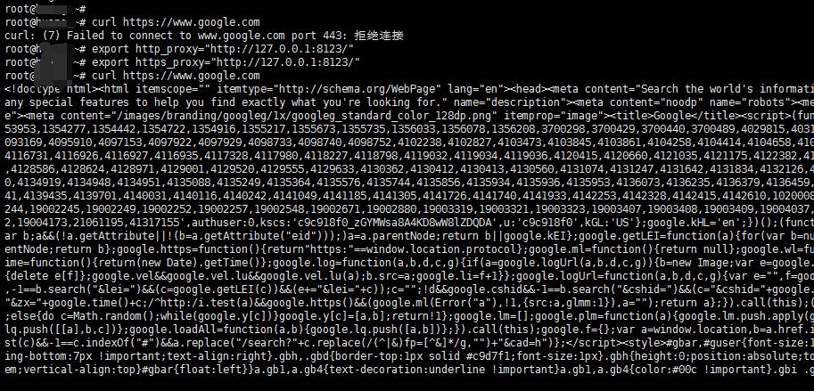

### 配置 ShadowSocks 客户端

```bash
sudo apt-get install python-pip
sudo pip install shadowsocks
sudo vim /etc/ssclient.conf
```

配置文件如下:

```json
{
    "server":"you_server_ip",
    "server_port":server_ip,
    "local_address": "127.0.0.1",
    "local_port":1080,
    "password":"you_service_passwd",
    "timeout":300,
    "method":"aes-256-cfb",
    "fast_open": true,                  
    "workers": 1
}

"method":  加密方式
"fast_open": 可选 true 或 false。如果你的服务器 Linux 内核在3.7+，可以开启 fast_open 以降低延迟。开启方法： echo 3 > /proc/sys/net/ipv4/tcp_fastopen 开启之后，将 fast_open 的配置设置为 true 即可
```

开启shadowsocks:

```bash
tmux

# 启动 SS
sudo nohup sslocal -c /etc/ssclient.conf >/dev/null 2>&1 &
# 查看进程
sudo ps aux |grep sslocal |grep -v "grep"

# 添加开启启动
echo "nohup /usr/local/bin/sslocal -c /etc/ssclient.conf /dev/null 2>&1 &" >> /etc/rc.local
```

如果启动`sslocal`出现错误:
```bash
AttributeError: /usr/lib/x86_64-linux-gnu/libcrypto.so.1.1: undefined symbol: EVP_CIPHER_CTX_cleanup
```

参考解决方案: [run sslocal raise error](https://github.com/shadowsocks/shadowsocks/issues/646#issuecomment-267977330):
```bash
pip install -U git+https://github.com/shadowsocks/shadowsocks.git@master
```

<hr>

### 使用 privoxy 将Sock5代理转化为Http代理

```bash
sudo apt-get install privoxy -y

```

修改配置文件:

```bash
sudo cp /etc/privoxy/config /etc/privoxy/config.bak     # 备份配置文件
sed -i '/^#/d' /etc/privoxy/config                      # 删除#开头的注释行(太多了,开着累)
sudo vim /etc/privoxy/config                            # 修改配置文件
```

找到 `listen-address` 确保有这行代码 `listen-address 127.0.0.1:8118`
找到 `forward-socks5` 确保有这行代码(没有自己加) `forward-socks5 / 127.0.0.1:1080 .`

配置文件如下:
```
user-manual /usr/share/doc/privoxy/user-manual
confdir /etc/privoxy
logdir /var/log/privoxy
actionsfile match-all.action # Actions that are applied to all sites and maybe overruled later on.
actionsfile default.action   # Main actions file
actionsfile user.action      # User customizations
filterfile default.filter
filterfile user.filter      # User customizations
logfile logfile
listen-address  127.0.0.1:8118
listen-address  [::1]:8118
toggle  1
enable-remote-toggle  0
enable-remote-http-toggle  0
enable-edit-actions 0
enforce-blocks 0
buffer-limit 4096
enable-proxy-authentication-forwarding 0
forwarded-connect-retries  0
accept-intercepted-requests 0
allow-cgi-request-crunching 0
split-large-forms 0
keep-alive-timeout 5
tolerate-pipelining 1
socket-timeout 300
forward-socks5 / 127.0.0.1:1080 .
```

启动`privoxy`

```bash
sudo service privoxy start
sudo service privoxy status
```

配置转发

```bash
export http_proxy="http://127.0.0.1:8118"
export https_proxy="http://127.0.0.1:8118"
```

测试

```bash
root@kali:~# curl 4.icanhazip.com
35.201.129.180
```

<hr>

### 也可以使用 Polipo 代替 Privoxy
```bash
sudo apt-get install polipo -y

cp /etc/polipo/config /etc/polipo/config.bak

cat > /etc/polipo/config<<EOF
logSyslog = true
logFile = /var/log/polipo/polipo.log
proxyAddress = "0.0.0.0"
socksParentProxy = "127.0.0.1:1080"
socksProxyType = socks5
chunkHighMark = 50331648
objectHighMark = 16384
serverMaxSlots = 64
serverSlots = 16
serverSlots1 = 32
EOF
sudo /etc/init.d/polipo restart
export http_proxy="http://127.0.0.1:8123/"
export https_proxy="http://127.0.0.1:8123/"
```


服务器重启后，下面两句需要重新执行：

```bash
sudo sslocal -c /etc/ssclient.conf -d start

export http_proxy="http://127.0.0.1:8123/"
export https_proxy="http://127.0.0.1:8123/"

```

取消代理:

```
unset http_proxy
unset https_proxy
```

#### 不安装`Privoxy`等代理服务器设置使用`shadowsocks`代理
```bash
export ALL_PROXY=socks5://127.0.0.1:1080

unset ALL_PROXY
```

<hr>

### 为git协议设置代理

使用ProxyChains-NG(坑越来越深Orz)
```bash
git clone https://github.com/rofl0r/proxychains-ng.git
cd proxychains-ng
./configure
(sudo) make && make install
cp ./src/proxychains.conf /etc/proxychians.conf
sudo vim /etc/proxychians.conf
```
将`socks4 127.0.0.1 9095`改为`socks5 127.0.0.1 1080`

在需要代理的命令前加上 `proxychains4` ，如：

```
proxychains4 git clone git://github.com/WordPress/WordPress.git
```


#### 参考链接:

- [Ubuntu 使用 ShadowSocks + Privoxy 代理](http://blog.forecho.com/ubuntu-use-shadowsocks-and-privoxy.html)
- [五大开源 Web 代理服务器横评：Squid、Privoxy、Varnish、Polipo、Tinyproxy](https://linux.cn/article-7119-1.html)
- [Ubuntu server命令行配置shadowsocks全局代理](https://jingsam.github.io/2016/05/08/setup-shadowsocks-http-proxy-on-ubuntu-server.html)
- [使用Privoxy、Polipo、3proxy转化Sock5代理为Http代理](https://www.igfw.net/archives/947)
- [如何在 Linux 里面代理 git://协议](https://www.v2ex.com/t/332816)
- [通过 ProxyChains-NG 实现终端下任意应用代理](https://www.hi-linux.com/posts/48321.html)
- [利用proxychains在终端使用socks5代理](https://blog.fazero.me/2015/08/31/%E5%88%A9%E7%94%A8proxychains%E5%9C%A8%E7%BB%88%E7%AB%AF%E4%BD%BF%E7%94%A8socks5%E4%BB%A3%E7%90%86/)

<hr>

#### 使用`supervisor`管理`shadowsocks`进程

安装supervisor
```bash
sudo apt-get install supervisor
```

添加ss配置文件

vim /etc/supervisor/conf.d/ss.conf
```bash
[program:ss]
command=/usr/local/bin/sslocal -c /etc/ssclient.conf
user=root
directory=/root
stdout_logfile=/var/log/supervisor/%(program_name)s-stdout.log
stderr_logfile=/var/log/supervisor/%(program_name)s-stderr.log
killasgroup=true
stopasgroup=true
```

使用`supervisor`启动ss:
```bash
sudo service supervisor restart
sudo supervisorctl restart ss

root@huang:~# lsof -i :1080
COMMAND  PID USER   FD   TYPE DEVICE SIZE/OFF NODE NAME
sslocal 3148 root    3u  IPv4  33691      0t0  TCP localhost:socks (LISTEN)
sslocal 3148 root    4u  IPv4  33692      0t0  UDP localhost:socks 
```

<!-- #### 使用`supervisor`管理`shadowsocks`与`privoxy`进程(好像不完美,待更改)

```bash
sudo apt-get install supervisor
sudo update-rc.d supervisor defaults
```

vim /etc/supervisor/conf.d/ss.conf
```
[program:ss]
command=/usr/local/bin/sslocal -c /etc/ssclient.conf
user=root
directory=/root
stdout_logfile=/var/log/supervisor/%(program_name)s-stdout.log
stderr_logfile=/var/log/supervisor/%(program_name)s-stderr.log
killasgroup=true
stopasgroup=true
```

vim /etc/supervisor/conf.d/privoxy.conf
```
[program:privoxy]
command= /usr/sbin/privoxy --pidfile /var/run/privoxy.pid --user privoxy /etc/privoxy/config
user=root
directory=/root
environment=http_proxy=http://127.0.0.1:8118,https_proxy=http://127.0.0.1:8118
stdout_logfile=/var/log/supervisor/%(program_name)s-stdout.log
stderr_logfile=/var/log/supervisor/%(program_name)s-stderr.log
killasgroup=true
stopasgroup=true
```

vim /etc/supervisor/conf.d/proxy.conf
```
[group:proxy]
programs=ss,privoxy
``` -->
